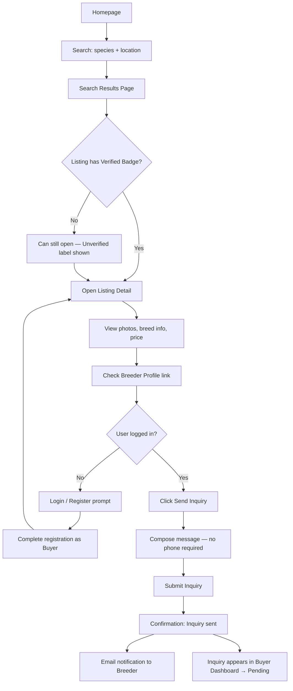
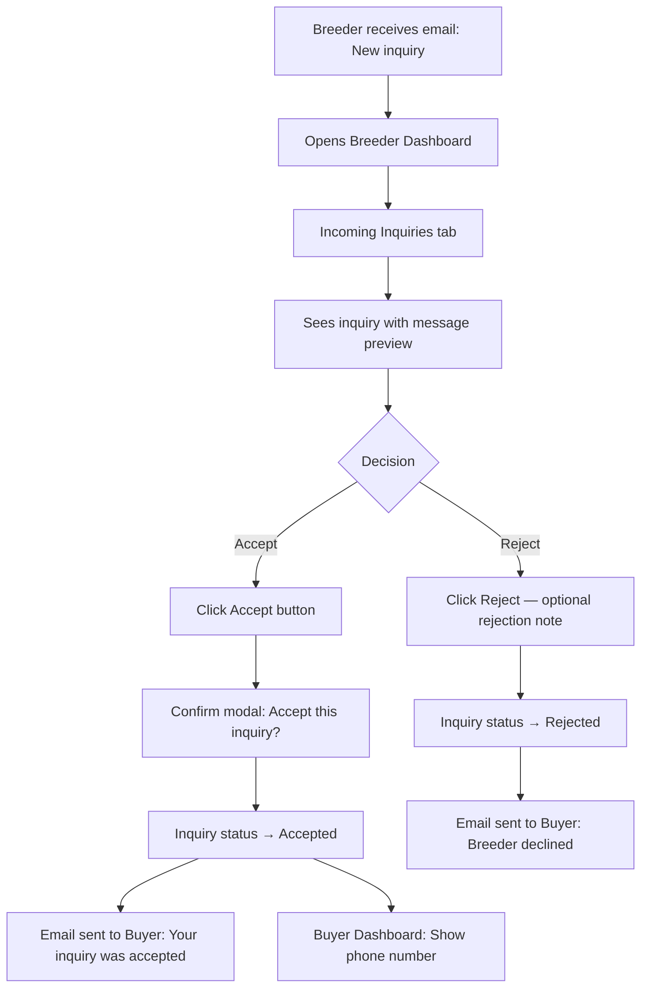
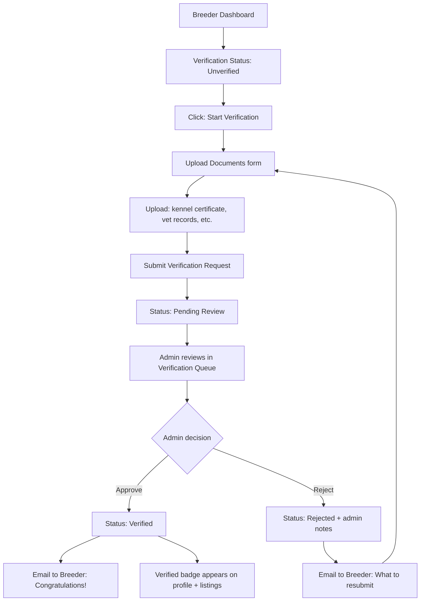
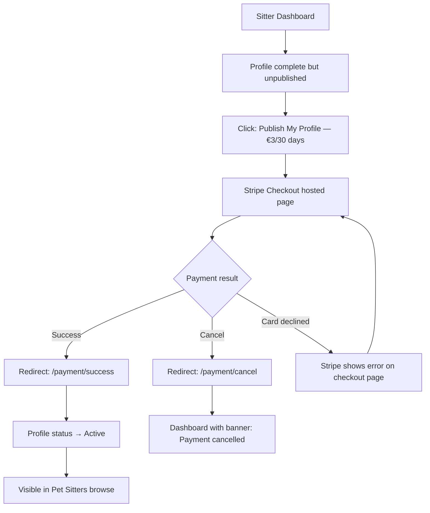
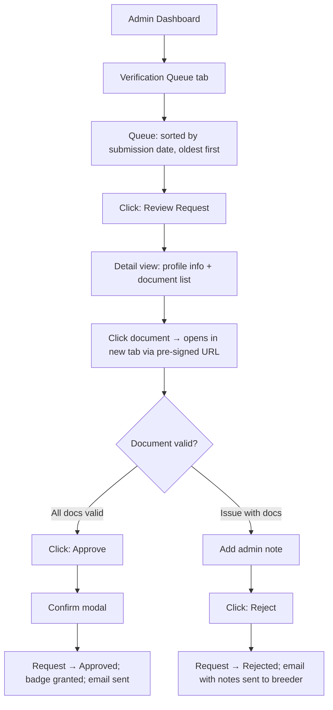

# PawTrust UI/UX Specification

**Version:** 1.0
**Date:** 2026-03-20
**Author:** Sally (UX Expert Agent)
**Status:** Draft

---

## Table of Contents

1. [Introduction](#1-introduction)
2. [Information Architecture](#2-information-architecture)
3. [User Flows](#3-user-flows)
4. [Wireframes & Screen Layouts](#4-wireframes--screen-layouts)
5. [Component Library](#5-component-library)
6. [Branding & Style Guide](#6-branding--style-guide)
7. [Accessibility Requirements](#7-accessibility-requirements)
8. [Responsiveness Strategy](#8-responsiveness-strategy)
9. [Animation & Micro-interactions](#9-animation--micro-interactions)
10. [Internationalization (i18n) UX](#10-internationalization-i18n-ux)

---

## 1. Introduction

This document defines the user experience goals, information architecture, user flows, and visual design specifications for PawTrust's user interface. It serves as the foundation for frontend development, ensuring a cohesive, trust-first, visually compelling experience for the Moldovan and Romanian pet market.

PawTrust's central UX challenge is **building trust before a transaction** — buyers have been burned by fraudulent listings on classifieds sites (OLX, 999.md). Every design decision must reinforce safety, transparency, and authenticity.

### 1.1 Overall UX Goals & Principles

#### Target User Personas

**1. The Burned Buyer (Primary)**

- Age 25–45, urban Moldova/Romania
- Has bought or nearly bought a pet from a scammer on OLX/999.md
- Highly suspicious; will leave if trust signals are absent
- Wants: verified breeders, real photos, safe contact flow
- Tech comfort: moderate (uses smartphones daily)

**2. The Responsible Breeder**

- Age 30–55, operates a registered kennel or cattery
- Frustrated that they're lumped in with scammers on classifieds
- Wants: professional profile, trust badge, direct contact with serious buyers
- Tech comfort: moderate; dislikes complex forms

**3. The Pet Sitter**

- Age 22–40, offers home-based or visit pet sitting
- Needs a professional web presence they currently lack
- Wants: profile with photos, clear pricing, easy booking inquiries
- Tech comfort: comfortable with apps

**4. The Platform Admin**

- Internal team member; reviews verification documents
- Needs: efficient document review interface, clear approve/reject workflow
- Tech comfort: high

#### Usability Goals

- **Ease of trust evaluation:** Within 10 seconds on a listing page, a buyer can determine if a breeder is verified
- **Inquiry without fear:** Submitting an inquiry requires no phone number reveal — buyers feel safe reaching out
- **Breeder onboarding in under 20 minutes:** Creating a profile + first listing + document upload ≤ 20 min
- **Admin verification in under 5 minutes per case:** Documents viewable, decision made, notification sent
- **Zero confusion on contact reveal:** Users always know exactly when and how contact details become available

#### Design Principles

1. **Trust is visible** — Verification status, badges, and review counts appear everywhere a user makes a decision
2. **Progressive disclosure** — Show minimum necessary info by default; reveal more on demand (contact, documents)
3. **Clarity over cleverness** — Plain language in both Romanian and Russian; no jargon
4. **Mobile-first, desktop-polished** — Most browsing happens on phones; management tasks need desktop comfort
5. **Warmth with professionalism** — Pet platforms should feel welcoming and warm, not clinical or corporate

### 1.2 Change Log

| Date       | Version | Description            | Author            |
| ---------- | ------- | ---------------------- | ----------------- |
| 2026-03-20 | 1.0     | Initial front-end spec | Sally (UX Expert) |

---

## 2. Information Architecture

### 2.1 Site Map / Screen Inventory

```mermaid
graph TD
    HOME[🏠 Homepage]

    HOME --> LISTINGS[Browse Listings]
    HOME --> SITTERS[Browse Pet Sitters]
    HOME --> AUTH[Auth Pages]

    LISTINGS --> LISTING_DETAIL[Listing Detail]
    LISTINGS --> BREEDER_PROFILE[Breeder Profile]
    LISTING_DETAIL --> BREEDER_PROFILE
    LISTING_DETAIL --> INQUIRY_FORM[Send Inquiry]

    SITTERS --> SITTER_DETAIL[Sitter Profile]
    SITTER_DETAIL --> SITTER_INQUIRY[Contact Sitter]

    AUTH --> REGISTER[Register]
    AUTH --> LOGIN[Login]
    AUTH --> FORGOT[Forgot Password]

    REGISTER --> ROLE_SELECT[Choose Role: Buyer / Breeder / Sitter]

    HOME --> BUYER_DASH[Buyer Dashboard]
    BUYER_DASH --> MY_INQUIRIES[My Inquiries]
    BUYER_DASH --> MY_REVIEWS[My Reviews]
    MY_INQUIRIES --> CONTACT_REVEAL[Revealed Contact]

    HOME --> BREEDER_DASH[Breeder Dashboard]
    BREEDER_DASH --> MY_LISTINGS[My Listings]
    BREEDER_DASH --> LISTING_CREATE[Create Listing]
    BREEDER_DASH --> LISTING_EDIT[Edit Listing]
    BREEDER_DASH --> INCOMING_INQUIRIES[Incoming Inquiries]
    BREEDER_DASH --> VERIFICATION_STATUS[Verification Status]
    BREEDER_DASH --> DOC_UPLOAD[Upload Documents]

    HOME --> SITTER_DASH[Sitter Dashboard]
    SITTER_DASH --> MY_PROFILE[My Profile]
    SITTER_DASH --> PAY_LISTING[Pay to Publish]

    HOME --> ADMIN_DASH[Admin Dashboard]
    ADMIN_DASH --> VERIF_QUEUE[Verification Queue]
    ADMIN_DASH --> USER_MGMT[User Management]
    ADMIN_DASH --> LISTING_MGMT[Listing Management]

    HOME --> PAYMENT_SUCCESS[Payment Success]
    HOME --> PAYMENT_CANCEL[Payment Cancelled]
```



### 2.2 Navigation Structure

**Primary Navigation (top navbar, all authenticated states):**

- Logo → Homepage
- Browse Listings
- Pet Sitters
- Language switcher (RO / RU)
- Auth: Login / Register (guest) OR User menu (authenticated)

**User Menu (authenticated dropdown):**

- Dashboard (role-based label: "My Dashboard" / "Breeder Dashboard" / "Admin Panel")
- Profile
- Logout

**Secondary Navigation (within dashboards — sidebar on desktop, tab bar on mobile):**

_Buyer:_ My Inquiries | My Reviews

_Breeder:_ My Listings | Incoming Inquiries | Verification | Documents

_Sitter:_ My Profile | Publish Listing

_Admin:_ Verification Queue | Users | Listings

**Breadcrumb Strategy:**

- Used on detail pages: `Home > Browse Listings > Golden Retriever Puppy — Paris Kennel`
- Not used in dashboards (sidebar navigation suffices)
- Not used on auth pages

---

## 3. User Flows

### 3.1 Buyer Finds and Contacts a Breeder

**User Goal:** Discover a verified breeder, evaluate trustworthiness, and safely send an inquiry without revealing personal data.

**Entry Points:** Homepage search, Google search → listing detail, Browse Listings page

**Success Criteria:** Inquiry submitted; buyer receives confirmation; breeder notified



**Edge Cases & Error Handling:**

- Listing is sold/expired: Show "No longer available" banner; hide inquiry form; suggest similar listings
- Buyer already sent inquiry to this listing: Show existing inquiry status, disable re-submit
- Not logged in: Clicking "Send Inquiry" opens a modal prompting Login/Register (not a full page redirect — preserve scroll context)
- Network error on submit: Show inline error toast; preserve message draft

---

### 3.2 Breeder Accepts Inquiry → Contact Revealed

**User Goal:** Breeder reviews inquiry and chooses to accept, revealing their phone to the buyer.

**Entry Points:** Email notification link → Breeder Dashboard → Incoming Inquiries

**Success Criteria:** Inquiry accepted; buyer's dashboard shows "Contact Revealed" with phone number



**Edge Cases & Error Handling:**

- Breeder accidentally rejects: Contact support email shown; no undo at MVP
- Buyer's account deleted: Inquiry still shows in breeder dashboard with "[Account removed]" label

---

### 3.3 Breeder Gets Verified

**User Goal:** Breeder uploads documents and receives a Verified badge upon admin approval.

**Entry Points:** Breeder Dashboard → Verification Status card → Upload Documents

**Success Criteria:** Verification badge visible on breeder profile and all listings



**Edge Cases & Error Handling:**

- Document upload fails: Inline error per file; retry without losing other uploads
- Request already pending: "Verification under review" banner; disable re-submit button
- Admin pre-signed URL expired (document view): Refresh button regenerates URL (15-min TTL)

---

### 3.4 Pet Sitter Pays to Publish Profile

**User Goal:** Pet sitter completes payment to activate their publicly visible profile.

**Entry Points:** Sitter Dashboard → Publish Listing button

**Success Criteria:** Payment completed; sitter profile live and searchable



**Edge Cases & Error Handling:**

- Webhook delayed: Profile may show "Activating…" for up to 30s; auto-refresh
- Duplicate payment (user double-clicks): Stripe idempotency key prevents duplicate charges; second checkout session redirects to already-active state

---

### 3.5 Admin Reviews Verification Request

**User Goal:** Admin efficiently reviews uploaded documents and approves or rejects a verification request.

**Entry Points:** Admin Dashboard → Verification Queue

**Success Criteria:** Decision recorded; breeder/sitter notified; badge state updated



**Edge Cases & Error Handling:**

- Pre-signed URL expires during review: "Refresh document link" button re-generates URL
- Two admins reviewing same request simultaneously: Last write wins; no locking at MVP (acceptable for small team)

---

## 4. Wireframes & Screen Layouts

**Design Files:** No Figma files at MVP — this spec serves as the design reference. Direct to code via TailwindCSS component development.

---

### 4.1 Homepage

**Purpose:** Entry point and trust-building landing page. Convert visitors into browsers.

**Key Elements:**

- Hero section: large headline ("Find your perfect pet — safely"), search bar (species + location), CTA "Browse Listings"
- Featured listings carousel: 4–6 cards with photo, breed, price, Verified badge
- Trust Pillars section: 3 columns — "Verified Breeders", "Safe Inquiries", "Honest Reviews" with icons and 1-sentence descriptions
- How It Works: 3-step horizontal strip — "Search → Inquire Safely → Meet Your Pet"
- Recent listings grid (6 cards)
- Footer: links, language switcher, contact email

**Interaction Notes:**

- Search bar is the primary CTA — autofocus on desktop
- Featured listings are sorted by `featured_until` DESC
- Trust Pillars section anchors below the fold to reward scroll

**Design File Reference:** N/A — code spec only

---

### 4.2 Search Results Page

**Purpose:** Let buyers efficiently filter and scan listings to find the right match.

**Key Elements:**

- Sticky filter sidebar (desktop) / collapsible filter drawer (mobile): species, breed, location, price range, "Verified only" toggle
- Results count: "24 listings found"
- Sort control: Newest | Price ↑ | Price ↓ | Featured first
- Listing card grid: 3-col desktop, 2-col tablet, 1-col mobile
- Pagination: previous/next + page numbers
- Empty state: "No listings match your filters" + reset filters CTA

**Listing Card Elements:**

- Primary photo (16:9 aspect ratio, object-cover)
- Verified badge (top-left overlay on photo, green)
- Unverified label (top-left, gray) — never hidden
- Breed + species
- Age (e.g., "8 weeks")
- Price with currency
- Location (city)
- Kennel name

**Interaction Notes:**

- "Verified only" toggle filters immediately (no page reload — query param update)
- Clicking a card → Listing Detail

---

### 4.3 Listing Detail Page

**Purpose:** Full listing evaluation page — the primary trust checkpoint before inquiry.

**Key Elements:**

- Photo gallery: main photo + thumbnail strip (swipeable on mobile)
- Listing header: title, breed, species chip, age, price, currency
- Trust bar: Verified badge OR Unverified notice (prominent) + review count
- Description: full text
- Breeder summary card (right sidebar on desktop, below content on mobile):
  - Kennel name, location, Verified badge
  - "View breeder profile" link
  - Star rating average + review count
- Inquiry action:
  - Guest: "Log in to send inquiry" button
  - Logged-in buyer: Inquiry form (message field + Submit)
  - Already sent inquiry: Status badge ("Pending" / "Accepted" / "Rejected")
  - Sold/expired: "No longer available" banner, inquiry form hidden

**Interaction Notes:**

- Unverified listings show a non-blocking yellow info box: "This breeder has not been verified yet. Proceed with caution."
- Photo gallery keyboard navigable (accessibility)
- Inquiry form textarea: minimum 20 characters enforced with live character count

---

### 4.4 Breeder Profile Page

**Purpose:** Full breeder public profile — trust profile for repeat buyers, profile marketing for breeders.

**Key Elements:**

- Header: kennel name, location, member since date, Verified badge (or Unverified label)
- Description / about section
- Breed specialization chip(s)
- Active listings grid (same cards as search results)
- Reviews section: rating summary (stars + count) + review cards (rating, comment, date, listing name)
- No phone number visible (ever) — only accessible via accepted inquiry

**Interaction Notes:**

- "0 active listings" state: shows "This breeder currently has no active listings" — does not 404
- Reviews are paginated (5 per page)

---

### 4.5 Pet Sitter Profile Page (Public)

**Purpose:** Sitter's professional presence — builds trust for pet owners.

**Key Elements:**

- Header: display name, location, Verified badge (if verified)
- Photo gallery (up to 5 sitter photos)
- About / description
- Services offered (chips): Home boarding | Day care | House visits | Walking
- Price per day + currency
- Contact action: "Send Inquiry" (same gate as listing inquiry — requires login)

**Interaction Notes:**

- Unpublished sitters (listing_paid_until is null or past) are not reachable via public URL — 404
- Published but unverified: visible with "Unverified" label

---

### 4.6 Buyer Dashboard

**Purpose:** Central hub for a buyer to track their inquiries and manage reviews.

**Layout:** Two-tab layout — "My Inquiries" | "My Reviews"

**My Inquiries Tab:**

- List of inquiry cards, sorted by most recent
- Each card: listing photo thumbnail, listing title, breeder name, inquiry date, status badge
- Status badges: `Pending` (gray) | `Accepted` (green) | `Rejected` (red)
- Accepted inquiries: "View Contact" button → modal showing phone number + copy-to-clipboard

**My Reviews Tab:**

- List of reviews submitted
- Each card: listing thumbnail, rating stars, comment excerpt, review date

**Empty States:**

- No inquiries: "You haven't sent any inquiries yet. [Browse Listings →]"
- No reviews: "You haven't left any reviews yet."

---

### 4.7 Breeder Dashboard

**Purpose:** Operational hub for breeders — manage listings, review inquiries, track verification.

**Layout:** Sidebar navigation (desktop) / bottom tabs (mobile): My Listings | Inquiries | Verification | Documents

**My Listings Tab:**

- Cards per listing: photo, title, status chip (draft/active/sold/expired), featured badge if applicable
- Actions: Edit | Mark as Sold | Delete
- CTA: "+ Create New Listing" button

**Incoming Inquiries Tab:**

- List sorted by date (newest first)
- Each card: buyer display name (first name only, no last name or email), listing name, message excerpt, date, status
- Pending inquiries: Accept button (green) | Reject button (red)
- Accepted: "Contact Revealed" chip shown
- Rejected: reason input optional before confirm

**Verification Status Tab:**

- Current status: Unverified / Pending Review / Verified (with date)
- Unverified: "Start Verification" CTA with explanation of benefits
- Pending: "Your documents are under review. We'll email you within 48 hours."
- Verified: Green checkmark + verification date

**Documents Tab:**

- List of uploaded documents with status chips
- Upload form: document type dropdown + file picker (PDF/JPG/PNG, max 10MB)

---

### 4.8 Admin Dashboard — Verification Queue

**Purpose:** Efficient document review interface for the admin team.

**Layout:** Full-width table-based layout — not a card grid

**Verification Queue Tab:**

- Table: columns — Requestor name | Type (Breeder/Sitter) | Submitted date | Status | Actions
- Filter by status: Pending (default) | Approved | Rejected
- Clicking a row → Verification Detail drawer/modal

**Verification Detail View:**

- Profile summary: name, type, location, email
- Documents list: each document type + "Open Document" button (opens pre-signed URL in new tab)
- Admin notes textarea
- Action buttons: "Approve" (green) | "Reject" (red) — both show confirmation modal
- Confirmation modals include the admin note as a preview of what will be emailed

---

### 4.9 Registration & Login

**Registration:**

- Single-page form: Name | Email | Password | Confirm Password | Role selection (Buyer / Breeder / Pet Sitter)
- Role selection as visual card selector (icon + label), not a dropdown
- On submit → email verification sent → redirect to "Check your email" screen

**Login:**

- Minimal: Email + Password + "Sign in" button
- "Forgot password?" link below form
- "Don't have an account? Register" link

**General Auth UX:**

- Inline validation (on blur per field, not on submit)
- Password: show/hide toggle
- No CAPTCHA at MVP
- After login, redirect to role-appropriate dashboard

---

### 4.10 Payment Success / Cancel Pages

**Payment Success:**

- Large checkmark icon (green)
- "Your listing is now active!"
- CTA: "View My Profile" button
- Auto-redirect to dashboard after 5 seconds (with countdown)

**Payment Cancelled:**

- Neutral tone (not alarming)
- "Payment was not completed."
- CTA: "Try Again" + "Go to Dashboard"

---

## 5. Component Library

**Design System Approach:** Custom component library built on TailwindCSS utility classes. No third-party component library (Chakra/MUI) — full visual control. Reusable components documented below.

---

### 5.1 VerifiedBadge

**Purpose:** Instantly communicates trust status across all contexts.

**Variants:**

- `verified` — green background, white checkmark + "Verified" text
- `unverified` — gray background, warning icon + "Unverified" text
- `icon-only` — small checkmark badge overlay (for listing cards)

**States:** Static — no hover/active state

**Usage Guidelines:**

- Always shown alongside a breeder or sitter name — never hidden
- `icon-only` used on listing cards (photo overlay, top-left)
- Full variant used on profile pages and listing detail pages

---

### 5.2 ListingCard

**Purpose:** Thumbnail representation of a listing in grids and carousels.

**Variants:**

- `default` — standard grid card
- `featured` — same as default + gold border + "Featured" label
- `sold` — grayscale photo + "Sold" overlay

**States:**

- Default
- Hover: subtle shadow lift (`shadow-md` → `shadow-lg`), scale 1.01
- Loading: skeleton placeholder (image rect + 3 text lines)

**Usage Guidelines:**

- Always 16:9 aspect ratio image
- Price always shown even if 0 (show "Contact for price")
- Always show VerifiedBadge overlay regardless of verification status

---

### 5.3 InquiryForm

**Purpose:** Inline message form for buyer to contact a breeder.

**Variants:**

- `active` — textarea + submit button
- `sent` — read-only status display ("Inquiry sent · Pending")
- `accepted` — green "Contact Revealed" status + RevealContact button
- `rejected` — red "Inquiry declined" status
- `locked` — "Log in to send inquiry" state

**States:** Textarea: default, focused, error (min length), disabled

**Usage Guidelines:**

- Minimum 20 character message enforced
- Character counter shown at 80+ characters (approaching a soft 500-char limit)
- Submit button disabled until minimum length met

---

### 5.4 PriceDisplay

**Purpose:** Consistent, currency-aware price rendering.

**Variants:** Inline text (listing cards) | Hero display (listing detail, large)

**Behavior:**

- Currency code placed after amount: `450 EUR`, `1.200 MDL`, `2.100 RON`
- Thousand separator: `.` (Romanian convention)
- Never formats as `€450` — always use ISO currency code for bilingual clarity

---

### 5.5 LocaleSwitcher

**Purpose:** Toggle between Romanian and Russian.

**Variants:** Text toggle (RO / RU) in nav header

**States:** Active locale is bold + underlined; inactive is plain text link

**Behavior:**

- Switching locale: updates `i18next` language + stores in localStorage/auth store
- Does NOT reload the page — instant translation swap

---

### 5.6 StatusBadge

**Purpose:** Communicate status across inquiries, listings, payments, verification.

**Variants/Colors:**

- `pending` — gray background, "Pending"
- `accepted` / `active` / `approved` — green, white text
- `rejected` / `expired` — red, white text
- `draft` — blue-gray, "Draft"
- `sold` — purple, "Sold"
- `featured` — gold/amber, "Featured"

**States:** Static; no interactive states

---

### 5.7 ProtectedRoute

**Purpose:** Client-side route guard redirecting unauthenticated or wrong-role users.

**Behavior:**

- Unauthenticated: redirect `/login?next={current_path}`
- Wrong role (e.g., buyer trying to access `/breeder/dashboard`): redirect to own dashboard
- After login: redirect to `next` param or role-appropriate dashboard

---

## 6. Branding & Style Guide

**Brand Guidelines:** No external brand guide — defined here as the canonical reference.

**Brand Personality:** Warm, trustworthy, modern. Think: "a certified breeder at a farmers market" — professional but approachable. Not clinical (like a vet site). Not flashy (like a pet toy brand).

### 6.1 Color Palette

| Color Type   | Hex Code  | Usage                                            |
| ------------ | --------- | ------------------------------------------------ |
| Primary      | `#2563EB` | Buttons, links, active nav, CTA elements         |
| Primary Dark | `#1D4ED8` | Button hover state                               |
| Secondary    | `#F97316` | Featured badges, trust accent — warm orange      |
| Accent       | `#10B981` | Verified badge, success states, accepted inquiry |
| Warning      | `#F59E0B` | Unverified notice, payment pending states        |
| Error        | `#EF4444` | Rejected status, form validation errors          |
| Neutral 900  | `#111827` | Body text, headings                              |
| Neutral 600  | `#4B5563` | Secondary text, metadata                         |
| Neutral 200  | `#E5E7EB` | Card borders, dividers                           |
| Neutral 50   | `#F9FAFB` | Page background                                  |
| White        | `#FFFFFF` | Card backgrounds, navbar                         |

**Design Note:** Primary blue (#2563EB = Tailwind `blue-600`) chosen for strong WCAG AA contrast on white. Orange secondary (#F97316 = Tailwind `orange-500`) provides warmth without feeling alarm-like. Green accent (#10B981 = Tailwind `emerald-500`) is universally associated with trust and safety.

### 6.2 Typography

**Font Families:**

- **Primary (UI):** `Inter` — clean, highly legible at small sizes, excellent Latin/Cyrillic support for RO + RU
- **Secondary (Display/Hero):** `Inter` — same family, heavier weights for headings (keeps bundle small)
- **Monospace:** `JetBrains Mono` — code only (admin views, reference IDs)

Load via Google Fonts: `Inter:wght@400;500;600;700`

**Type Scale (desktop):**

| Element       | Size            | Weight | Line Height |
| ------------- | --------------- | ------ | ----------- |
| H1            | 2.25rem (36px)  | 700    | 1.2         |
| H2            | 1.875rem (30px) | 700    | 1.25        |
| H3            | 1.5rem (24px)   | 600    | 1.3         |
| H4            | 1.25rem (20px)  | 600    | 1.4         |
| Body          | 1rem (16px)     | 400    | 1.6         |
| Small / Meta  | 0.875rem (14px) | 400    | 1.5         |
| Label / Badge | 0.75rem (12px)  | 500    | 1.4         |

### 6.3 Iconography

**Icon Library:** Heroicons v2 (MIT license, maintained by Tailwind Labs team)

- Source: `@heroicons/react`
- Style: Outline (24px) for navigation and UI; Solid (20px) for badges and compact UI
- Verification checkmark: `CheckBadgeIcon` (full) / `CheckIcon` (compact)
- Species icons: use simple emoji as fallback at MVP (🐕 🐈)

**Usage Guidelines:**

- Icons never appear alone without accessible `aria-label` or adjacent text
- Size 24px in navigation, 20px in cards, 16px in inline text context
- Color: inherit from parent text color unless used as status indicators

### 6.4 Spacing & Layout

**Grid System:** 12-column CSS grid; Tailwind responsive grid classes

**Max content width:** `max-w-7xl` = 1280px, centered, horizontal padding `px-4 sm:px-6 lg:px-8`

**Spacing Scale (Tailwind defaults):**

| Token      | px   | Usage                    |
| ---------- | ---- | ------------------------ |
| `space-1`  | 4px  | Tight icon/text gap      |
| `space-2`  | 8px  | Inline element gap       |
| `space-4`  | 16px | Card internal padding    |
| `space-6`  | 24px | Section internal spacing |
| `space-8`  | 32px | Between page sections    |
| `space-12` | 48px | Major section breaks     |
| `space-16` | 64px | Hero section padding     |

**Border Radius:**

- Cards: `rounded-xl` (12px)
- Buttons: `rounded-lg` (8px)
- Badges/chips: `rounded-full`
- Inputs: `rounded-lg` (8px)

---

## 7. Accessibility Requirements

**Standard:** WCAG 2.1 Level AA (required by PRD NFR9)

### 7.1 Visual Requirements

**Color Contrast:**

- Body text on white: minimum 4.5:1 (Neutral 900 `#111827` on white = 16.75:1 ✅)
- Secondary text on white: minimum 4.5:1 (Neutral 600 `#4B5563` on white = 7.0:1 ✅)
- White text on Primary blue: minimum 3:1 (large text) / 4.5:1 (normal) — `#2563EB` passes at 5.1:1 ✅
- Verified badge (white on `#10B981`): 3.05:1 — use on large text/icons only; add black text fallback for body copy

**Focus Indicators:**

- All interactive elements have visible `focus-visible` ring: `ring-2 ring-blue-500 ring-offset-2`
- Focus ring not suppressed via `outline: none` without replacement

**Text Sizing:**

- Minimum body font size: 16px (1rem)
- No text smaller than 12px (badge labels)
- Text scales with browser zoom up to 200% without horizontal scrolling

### 7.2 Interaction Requirements

**Keyboard Navigation:**

- All interactive elements reachable via Tab key
- Modals: focus trapped within modal when open; returned to trigger element on close
- Photo gallery: Left/Right arrow key navigation
- Dropdown menus: escape key closes; arrow keys navigate options

**Screen Reader Support:**

- All images have descriptive `alt` attributes (listing photos: "Photo of [breed] puppy from [kennel name]")
- Icon-only buttons have `aria-label`
- Dynamic content updates (inquiries accepted) announced via `aria-live="polite"`
- Page titles updated on SPA navigation via React Helmet

**Touch Targets:**

- Minimum 44×44px touch target for all interactive elements (WCAG 2.5.5)
- Listing cards are fully clickable (not just the title link)
- Action buttons in mobile dashboards minimum `h-12` (48px)

### 7.3 Content Requirements

**Alternative Text:**

- Listing photos: `alt="[Breed] puppy from [Kennel Name]"`
- Profile photos: `alt="[Display Name] – pet sitter"`
- Decorative illustrations: `alt=""`
- VerifiedBadge icon: `aria-label="Verified breeder"` or `aria-label="Unverified breeder"`

**Heading Structure:**

- Each page has exactly one `<h1>`
- Logical heading hierarchy (no skipping h2 → h4)
- Dashboard sections use `<h2>` for tab names, `<h3>` for card headings

**Form Labels:**

- All inputs have visible label elements (not just placeholders)
- Error messages associated via `aria-describedby`
- Required fields marked with `aria-required="true"` + visual asterisk

### 7.4 Testing Strategy

- Automated: `axe-core` integrated in Jest tests (checks component-level violations)
- Manual: keyboard-only navigation walkthrough of all 5 critical user flows before launch
- Screen reader: NVDA + Firefox manual test on Registration, Inquiry, and Admin flows
- Color blindness: Deuteranopia simulation (no information conveyed by color alone — badges always include text)

---

## 8. Responsiveness Strategy

### 8.1 Breakpoints

| Breakpoint | Min Width | Max Width | Target Devices                                       |
| ---------- | --------- | --------- | ---------------------------------------------------- |
| Mobile     | 0px       | 639px     | Phones (primary browsing device for Moldova/Romania) |
| Tablet     | 640px     | 1023px    | Tablets, large phones in landscape                   |
| Desktop    | 1024px    | 1279px    | Laptops, desktop monitors                            |
| Wide       | 1280px    | —         | Large monitors                                       |

(Aligned with Tailwind's default breakpoints: `sm:`, `md:`, `lg:`, `xl:`)

### 8.2 Adaptation Patterns

**Layout Changes:**

- Listing grid: 1-col (mobile) → 2-col (tablet) → 3-col (desktop)
- Listing detail: stacked (mobile) → two-column with sidebar (desktop)
- Breeder/Sitter dashboards: bottom tab bar (mobile) → left sidebar (desktop)
- Admin dashboard: full-width table with horizontal scroll (mobile) → full table (desktop)

**Navigation Changes:**

- Mobile: hamburger menu → slide-out drawer (full-screen nav)
- Tablet: compact nav with icon-only items
- Desktop: full horizontal nav with text labels
- Language switcher always visible regardless of breakpoint

**Content Priority (mobile stacking order):**

1. Listing Detail: Photos → Title/Price/Badges → Inquiry Form → Breeder Card → Description
2. Breeder Profile: Header/Badge → Description → Listings → Reviews
3. Dashboard: Status cards → Action list → History

**Interaction Changes:**

- Filter sidebar (Search): becomes bottom drawer on mobile with "Apply Filters" button
- Hover states replaced with tap states on touch devices
- Photo gallery: swipe gesture on mobile; click on desktop

---

## 9. Animation & Micro-interactions

**Motion Principles:**

- **Purposeful:** Every animation communicates something (loading, success, state change)
- **Fast:** Durations 150–300ms — do not delay users
- **Reducible:** Respect `prefers-reduced-motion` — all animations disabled for users who request it

### 9.1 Key Transitions

| Interaction           | Animation                   | Duration | Easing      |
| --------------------- | --------------------------- | -------- | ----------- |
| Page navigation       | Fade in (opacity 0→1)       | 150ms    | ease-out    |
| Modal open            | Scale up from 95% + fade in | 200ms    | ease-out    |
| Modal close           | Scale down + fade out       | 150ms    | ease-in     |
| Dropdown open         | Slide down + fade in        | 150ms    | ease-out    |
| Listing card hover    | Shadow + scale 1.01         | 150ms    | ease-out    |
| Button click          | Scale down 0.97             | 100ms    | ease-in-out |
| Toast notification    | Slide in from bottom-right  | 250ms    | spring      |
| Status badge change   | Background color crossfade  | 300ms    | ease        |
| Inquiry form submit   | Button spinner → checkmark  | 200ms    | ease        |
| Verified badge reveal | Pop scale 0.8→1.0           | 250ms    | spring      |

### 9.2 Loading States

- **Initial page load:** Skeleton screens (gray placeholder bars matching content layout) — not spinners
- **API fetches (TanStack Query):** Skeleton screens for listings grids; inline spinner for small components
- **Button actions (submit, accept, reject):** Button replaces text with spinner; disabled during request
- **Image loading:** CSS `bg-gray-100` placeholder until image loads; no layout shift (`aspect-ratio` enforced)

### 9.3 Feedback Micro-interactions

- **Inquiry sent:** Quick burst animation on the "sent" checkmark icon
- **Verification approved (admin):** Green ripple from Approve button
- **Contact revealed:** Phone number animates in with a fade+slide (not a jarring pop)
- **Copy to clipboard (phone number):** Button text changes from "Copy" → "Copied ✓" for 2 seconds

---

## 10. Internationalization (i18n) UX

### 10.1 Language Coverage

| Language | Code | Script   | Status            |
| -------- | ---- | -------- | ----------------- |
| Romanian | `ro` | Latin    | Primary / Default |
| Russian  | `ru` | Cyrillic | Secondary         |

### 10.2 UX Considerations for Bilingual Interface

**Script switching (RO → RU):**

- Cyrillic text is slightly wider than Latin equivalents — UI must not break on Cyrillic
- All text containers must use `overflow-wrap: break-word` — no hard pixel widths for text boxes
- Button labels tested in both scripts: "Trimite interogare" (RO, 20 chars) vs "Отправить запрос" (RU, 16 chars)
- Badges and short labels: cap at ~12 characters; both languages fit within `rounded-full` badge at `text-xs`

**Right-to-left:** Not required (Romanian and Russian are both LTR)

**Number formats:**

- Prices: `1.200 EUR` (period as thousands separator — Romanian/European convention)
- Dates: `DD.MM.YYYY` format (e.g. `20.03.2026`) for both locales
- No AM/PM — 24-hour time format in all contexts

**Language switcher placement:**

- Persistent in top navigation (desktop + mobile)
- Guest users: locale stored in `localStorage`
- Authenticated users: locale stored in user profile (`users.locale` column)
- Server responds to `Accept-Language` header for validation messages

### 10.3 Translation Key Conventions

```
// Namespaces: common | listings | auth | dashboard | admin | payments
// Keys: camelCase, descriptive
common.verifiedBadge = "Verificat" / "Проверено"
listings.sendInquiry = "Trimite interogare" / "Отправить запрос"
listings.contactRevealed = "Contact dezvăluit" / "Контакт раскрыт"
dashboard.inquiryPending = "În așteptare" / "На рассмотрении"
auth.emailVerificationSent = "Am trimis un link de verificare la {{email}}"
```

- All user-facing strings go through i18next — no hardcoded Romanian text in JSX
- Pluralization rules defined for both locales (Romanian has complex plural forms)
- Missing translation fallback: Romanian (`ro`) — never shows raw keys to users

---

**Document Status: COMPLETE — Ready for developer handoff**

